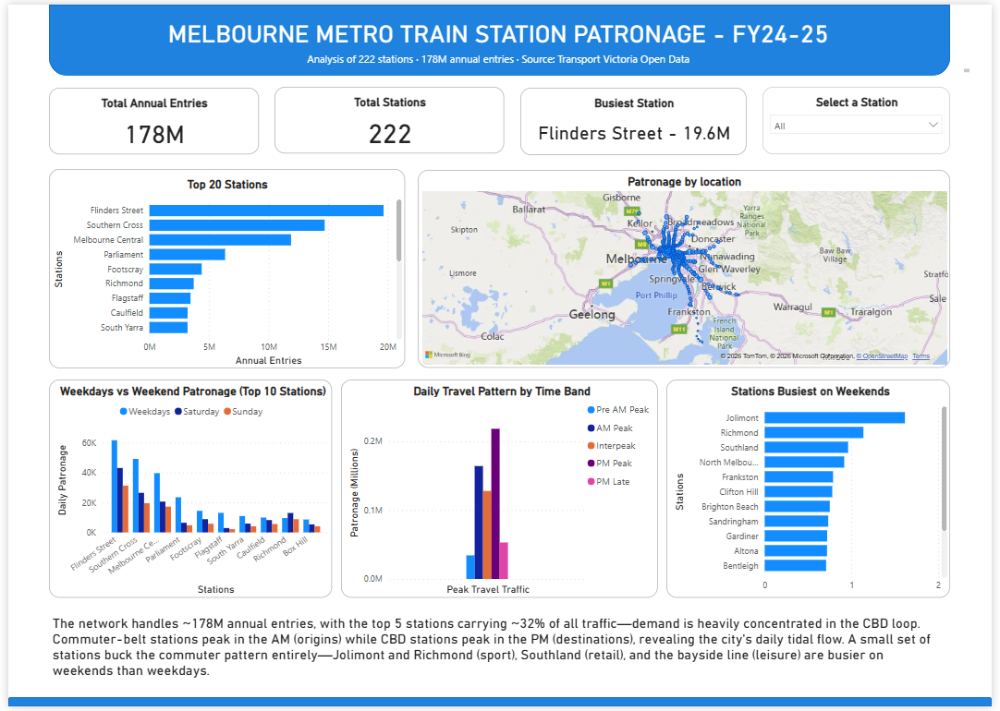

# Melbourne Metro Train Station Patronage Analysis (FY2024–25)

An interactive Power BI dashboard analysing patronage across all 222 stations on Melbourne's metropolitan train network, using open data from Transport Victoria.

## The question

Where and when is demand concentrated on Melbourne's metro train network — and which stations behave differently from the typical commuter pattern?

## Key findings

- **Demand is highly concentrated.** The network handles ~178M annual entries, but the top 5 stations carry ~32% of all traffic. Flinders Street alone sees 19.6M entries a year.
- **The city has a daily tidal flow.** Outer commuter-belt stations (e.g. Williams Landing, Craigieburn) peak in the AM as people board *into* the city, while CBD stations (Flinders Street, Southern Cross, Parliament) peak in the PM as people board to leave — an AM-origin / PM-destination mirror pattern.
- **Some stations buck the commuter pattern entirely.** A small set are busier on weekends than weekdays: Jolimont and Richmond (sport/MCG precinct), Southland (retail), and the bayside line (leisure) — driven by destinations rather than commuting.

## Dashboard features

- Headline cards: total annual entries, station count, busiest station
- Top 20 busiest stations (ranked bar chart)
- Geographic patronage map (bubble size = annual entries)
- Daily travel pattern by time band (Pre-AM, AM peak, interpeak, PM peak, PM late)
- Weekday vs weekend patronage comparison
- "Weekend ratio" analysis isolating leisure/event-driven stations
- Station slicer to filter the whole report

## Tools & techniques

- **Power BI Desktop** — data modelling and dashboard
- **Power Query** — data cleaning and type handling
- **DAX** — calculated column (weekend ratio) and measure (busiest station)

## Data source

[Annual metropolitan train station patronage (station entries)](https://opendata.transport.vic.gov.au/dataset/annual-metropolitan-train-station-patronage-station-entries) — Transport Victoria Open Data. Patronage estimates are derived from myki ticketing data and rounded to the nearest 50.

## Files

- `melbourne_train_patronage.pbix` — the Power BI file
- `dashboard.png` — dashboard screenshot
- `annual_metropolitan_train_station_entries_fy_2024_2025.csv` — source data

---

*Built by [Ragul Balaji Selvaraj](https://www.linkedin.com/in/ragulbalajiselvaraj) · [GitHub](https://github.com/ragul-selvaraj)*
